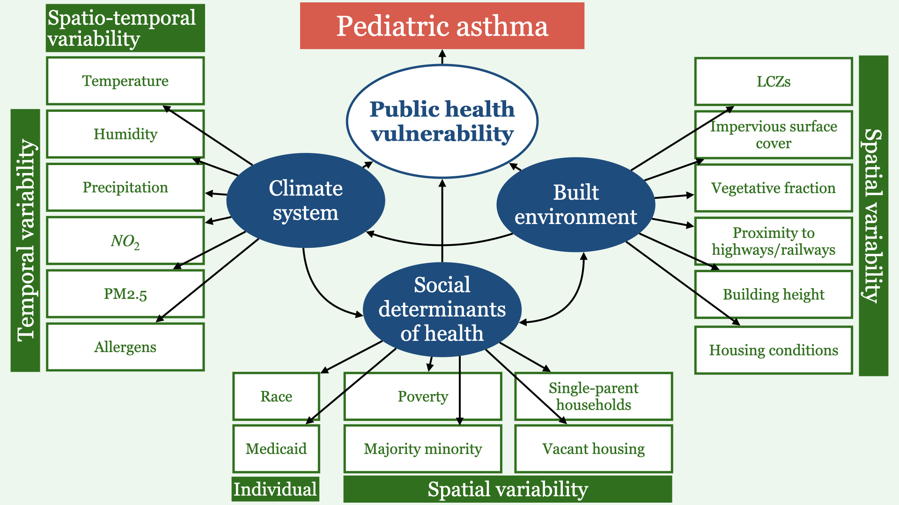

# Current research and limitations {#limits}

While there are many studies of the relationship between health outcomes in relation to urban heat, heat waves, and other atmospheric conditions like air pollution levels, health data are often too aggregated to get a sense of the spatial dependency of these relationships [@Anderson2009; @Ayres-Sampaio2014; @babinPediatricPatientAsthmarelated2007; @delamaterAnalysisAsthmaHospitalizations2012; @ferreirabragaTimeCourseWeatherRelated2001; @mirekuChangesWeatherEffects2009; @sonejaExposureExtremeHeat2016]. Patterns of these variables vary spatially [@okeEnergeticBasisUrban1982; @Jerrett2008] in ways that affect exposure and health outcomes [@jiaTop10Research2019; @sonejaExposureExtremeHeat2016; @williamsSocialDeterminantsTaking2009]. In a review of studies on environmental impacts on pediatric asthma, @pollockOutdoorEnvironmentPediatric2017 found that the spatio-temporal variation of pollutants has not been adequately investigated and @chenSpatiotemporalRelationshipParticle2007 found that effects could be underestimated if the spatial relationship was ignored. These variations are obscured when working at too coarse a spatial resolution. Similarly, the short-term temporal variation of atmospheric conditions can trigger acute asthma episodes [@raunUsingCommunityLevel2014] that is obscured by long-term averaging [@brewerDoesNeighborhoodSocial2017]. Long-term averaging smooths over events like heat waves that can exacerbate asthma [@linExtremeHighTemperatures2009].

Likewise, while many studies research the relationship between health outcomes and the built and physical environment, most are focused on the benefits of proximity to greenspace [@villeneuveCohortStudyRelating2012; @vienneauMoreCleanAir2017] or the negatives of proximity to busy transportation corridors [@liAsthmaExacerbationProximity2011; @lindgrenAsthmaExacerbationsTraffic2016] or point source polluters [@buteauReviewEffectAir2019]. Most often these studies do not consider the relationship between the built and physical environment and the urban atmosphere [@marteniesDiseaseHealthInequalities2017], i.e. what are the spatial characteristics of the environment that lead to differential concentrations of air pollutants? For instance, urban trees remove pollutants from the air through uptake and deposition [@nowakAirPollutionRemoval2006; @janhallReviewUrbanVegetation2015] and street canyons influence airflow and dispersion of pollutants [@janhallReviewUrbanVegetation2015].

Additionally, many of these studies do not ask how these relationships may vary by social factors like ethnicity or poverty [@Ayres-Sampaio2014; @delamaterAnalysisAsthmaHospitalizations2012] although many studies show that they do [@linExtremeHighTemperatures2009; @marteniesDiseaseHealthInequalities2017]. It has been repeatedly illustrated that there are striking socioeconomic disparities in health outcomes including asthma, environmental exposure, and access to resources [@geeEnvironmentalHealthDisparities2004; @Heaton2014; @hoffmanEffectsHistoricalHousing2020; @Huang2011; @Uejio2011; @williamsSocialDeterminantsTaking2009; @brewerDoesNeighborhoodSocial2017; @milliganAsthmaUrbanChildren2016]. These inequalities manifest at different levels of spatial hierarchy, and health outcomes need to be considered not only at the system level (county or metro area) or community level (zip code or census block group) but also at the individual level [@geeEnvironmentalHealthDisparities2004; @Uejio2011]. Research that includes only a single level is unlikely to capture the complex and multidimensional interactions that produce variations in health [@williamsSocialDeterminantsTaking2009].

It is no simple task to model the interactions and feedbacks of these systems [@costanzaModelingComplexEcological1993a]. Each system itself arises from processes that occur at different scales both spatially and temporally [@wikleHierarchicalModelsEnvironmental2003; @costanzaModelingComplexEcological1993a]. Researchers often simplify these complexities by assuming linearity and ignoring multivariate interactions [@wikleHierarchicalModelsEnvironmental2003; @costanzaModelingComplexEcological1993a]. A frequent solution is to analyze the multivariate interactions separately, yet these assumptions cannot be justified when trying to understand the whole as more than the sum of its parts. Often there is a mismatch between the support and alignment of available data in both time and space [@wikleHierarchicalModelsEnvironmental2003] and frequently this is addressed with methods that propagate error or ignore the underlying processes that may give rise to a signal. There may be varying intervals of time between environmental process, exposure, and health effect that should not be ignored [@Liu2007a].

These systems that affect health---atmospheric, environmental, and social---are inextricably intertwined (Fig. \@ref(fig:data)). For example: it has been well established that increased impervious surfaces and the lack of greenspace in urban areas contribute to the urban heat island effect (UHI) where temperatures are higher in urban areas relative to surrounding rural areas [@okeEnergeticBasisUrban1982]. It has also been shown that areas that were subject to redlining have increased temperatures relative to areas that were greenlined [@hoffmanEffectsHistoricalHousing2020]. Research also shows that there are significant income and racial disparities in access to public greenspace [@abercrombieIncomeRacialDisparities2008]. Increased heat has significant negative effects on health [@Horton2016]. So how to disentangle these factors? Although it seems to be the privilege of a discipline to decide which variables to consider mediating, moderating, or confounding, this avoids the need to characterize urban systems not as partitions of relationships but as complex, hierarchical, and coupled.

```{r data, fig.cap=cap}


cap <- "Interactions between systems."
```

# Specific limitations 

There are many complications and limitations that arise when modeling coupled human-natural systems. Data are often missing, especially in regards to remotely sensed imagery. Cloud contamination compromises scenes and renders many useless. Data from meteorological stations are frequently missing and stations are geographically sparse. Individual and community characteristics may be measured with qualitative surveys, presenting their own set of issues when combined with quantitative data. Datasets have varying spatial and temporal granularities such as census tracts or raster cells dividing the city and days, seasons, and years dividing time series. These datasets provide varying levels of detail with larger scale geographic and temporal increments resulting in poor localization. Due to the complex interactions of systems, variables inevitable suffer from multicollinearity and frequently spatial and temporal autocorrelation. Hierarchies occur structurally, spatially, and temporally with couplings between human and environment at every level. Statistical methods make assumptions about the distribution of data and relationships and require transdisciplinary knowledge of social, physical, environmental, and atmospheric processes and structures. While problematic, these issues pose an intriguing challenge.

Some selected studies will serve to highlight some of these limitations:

@Ayres-Sampaio2014 found that hospital admission rates due to asthma were positively related to $NO_2$ and air temperature and negatively related to NDVI. However, they examined relationships in linear regressions for each variable separately. Air temperature, $NO_2$, NDVI, and additionally relative humidity and $PM_{10}$ are not independent of each other with the authors even stating the NDVI and $NO_2$ were highly correlated in every season. Additionally, the variables included were seasonal averages per municipality and outside of NDVI and the hospitalization rates, the variables were derived from modeling including Kriging for the relative humidity, land-use regression for $NO_2$ and $PM_{10}$, and calculating the air temperature from a DEM, MODIS temperature profiles, and air pressure from meteorological stations. Not only does this increase dependence among the independent variables because many are calculated based on the others, any error in these calculations would compound in the linear regressions with hospitalization rate.

@villeneuveCohortStudyRelating2012 found a decrease in mortality associated with proximity to greenspace that was not influenced by levels of $PM_{2.5}$, $NO_2$ or the distance to roadways. However, their measures of $PM_{2.5}$ were city-wide, annual measures, $NO_2$ was estimated using a land-use regression and only for 3 out of the 10 urban areas included in the study, and proximity to greenspace was calculated for each individual at the time of their entry into the cohort without taking into consideration the fact that people move all the time. @vienneauMoreCleanAir2017 followed similar methods, finding a negative relationship between mortality and proximity to greenspace, but also without re-evaluating greenspace proximity over the course of the eight-year follow up. Additionally, although the cohort was monitored from 2000-2008, the NDVI was calculated using imagery from 2014.

@babinPediatricPatientAsthmarelated2007 examined the emergency room visitation and admissions rates per zip code; even the authors admit that aggregating to the zip code level likely obscures statistically important heterogeneity. The rates were calculated after removing long-term seasonal trends with a natural cubic spline with 12 knots. They found strong and significant relationships between pediatric asthma and ozone and weed pollen, especially among children ages 5-12. They also found a strong logarithmic relationship between both emergency room (ER) visits and emergency room admissions and the percent of households living below the poverty line. Like @Ayres-Sampaio2014, it seems as though they considered the relationships between the independent variables and the emergency room rate separately without controlling for the other variables which include: $O_3$; $PM2.5$; daily maximum temperature; tree, grass, and weed pollen; and mold, although the methods are not clear. Although they examined ER visit rate variation across poverty levels, they did this separately from the atmospheric and environmental analysis. 

@brewerDoesNeighborhoodSocial2017 examine the relationship between social and environmental context and pediatric asthma rates. They use a cross-classified multi-level logistic regression analysis to account for the fact that children are both nested within neighborhoods (census tracts) and cross classified within clinics and to assess the variance contributed by each. The dependent variable was a binary prediction of child diagnosis. They used the first dimension of a principal components analysis based on census tract characteristics to develop a measure of concentrated disadvantage. Other independent variables include: $O_3$ and $PM2.5$ both calculated as quarterly means, individual-level demographic characteristics, and the percent of neighborhood residents that share the individual's race/ethnicity. They found that concentrated disadvantage increased asthma and that the coethnic percentage increased the odds of asthma diagnosis for Black and asian children but not white or Hispanic. These disparities were evident even after accounting for both individual and neighborhood characteristics. They found no effect for $O_3$ and $PM2.5$. Although the authors did an excellent job of designing their research, they admit that increased measures of air pollution would better describe the relationship between air quality and asthma incidence. They speculate that Houston's poor air quality overall may be responsible for the lack of relationship, which may indicate the need for a third level of hierarchy representing the city overall. Additionally, the long-term averages of $O_3$ and $PM2.5$ obscure any relationship between air pollution and acute asthmatic episodes. They also acknowledge the possibility that multivariate regression can obscure the spatial variability of environmental indicators.


