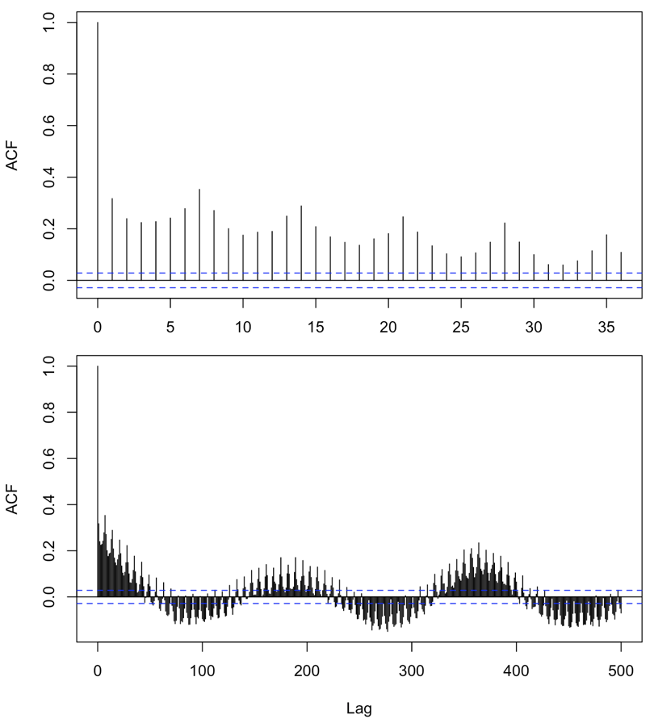

# Preliminary analysis {#prelim}

Some preliminary analysis highlights some of the limitations and challenges. The asthma data are characterized by weekly and seasonal trends that must be accounted for (Fig. \@ref(fig:acf)). Additionally, the asthma data is nonstationary with counts increasing every year (Fig. \@ref(fig:ann-counts)).

```{r acf, fig.cap=cap}


cap <- "The autocorrelation function shows the weekly and seasonal trends in the asthma data."
```

```{r ann-counts, fig.cap=cap}
include_graphics("images/monthly_counts.pdf")

cap = "Asthma counts are increasing every year."
```

These trends are lessened when considering only the level 3 severity but this limits statistical power and level 2 severity is also considered an acute care visit (Fig. \@ref(fig:trend-sev)).

```{r trend-sev, fig.cap=cap, fig.show = "hold", out.width = "50%", fig.align = "default"}
include_graphics("images/monthly_counts_severity.pdf")
include_graphics("images/wday_counts_severity.pdf")

cap <-  "Level 3 severity is less influenced by trends."
```

Regardless of trends, there are clear anomalies that should be investigated (Fig. \@ref(fig:anomalies)).

```{r anomalies, fig.cap=cap}
include_graphics("images/avg_count.pdf")

cap <- "Daily counts by year with 12-year average. There are clear anomalous asthma events."
```

```{r setup, include = FALSE, cache = FALSE}
# knitr::opts_chunk$set(echo = FALSE, message = FALSE, warning = FALSE)
# # Read in data from Load_data.R in scripts folder
# 
# source(here("scripts", "Load_data.R"), local = knitr::knit_global())
```


```{r include=F}
# Count or rate? Comparing mean and variance for both.
# all.levels %>% 
#   group_by(GEOID10) %>% 
#   summarise(mean = mean(count),
#             var = var(count)) %>% 
#   pivot_longer(cols = 2:3, names_to = "Measure") %>% 
# ggplot() +
#   geom_col(aes(x = GEOID10, y = value, color = Measure), position = position_dodge())
# 
# all.levels %>% 
#   group_by(Date) %>% 
#   summarise(mean = mean(count),
#             var = var(count)) %>% 
#   pivot_longer(cols = 2:3, names_to = "Measure") %>% 
#   ggplot() +
#   geom_line(aes(x = Date, y = value, color = Measure))
# 
# all.levels %>% 
#   filter(count != 0) %>% 
# ggplot() +
#   geom_histogram(aes((count)))
# 
# all.levels %>% 
#   group_by(Date) %>% 
#   summarise(mean = mean(`Asthma rate`),
#             var = var(`Asthma rate`)) %>% 
#   pivot_longer(cols = 2:3, names_to = "Measure") %>% 
#   ggplot() +
#   geom_line(aes(x = Date, y = value, color = Measure))
# 
# all.levels %>% 
#   group_by(GEOID10) %>% 
#   summarise(mean = mean(`Asthma rate`),
#             var = var(`Asthma rate`)) %>% 
#   pivot_longer(cols = 2:3, names_to = "Measure") %>% 
# ggplot() +
#   geom_col(aes(x = GEOID10, y = value, color = Measure), position = position_dodge())
# 
# all.levels %>% 
#   filter(count != 0) %>% 
# ggplot() +
#   geom_histogram(aes((`Asthma rate`)))
```
```{r include = F}
# ggplot(all.levels) +
#   geom_boxplot(aes(`Pct minority`, factor(count)))
# 
# ggplot(all.levels) +
#   geom_point(aes(`Pct minority`, `Asthma rate`))
# 
# ggplot(all.levels) +
#   geom_boxplot(aes(mean.imp, factor(count)))
# 
# ggplot(all.levels) +
#   geom_point(aes(mean.imp, `Asthma rate`))
# 
# ggplot(all.levels) +
#   geom_point(aes(mean.imp, `Pct minority`)) + 
#   geom_smooth(aes(mean.imp, `Pct minority`), method = "lm")
# 
# ggplot(all.levels) +
#   geom_point(aes(mean.imp, `Median LST`)) + 
#   geom_smooth(aes(mean.imp, `Median LST`), method = "lm")
# 
# ggplot(all.levels) +
#   geom_boxplot(aes(`Median LST`, factor(count)))
```


```{r LST-pctmin-quant, fig.cap = cap, echo = F}
# Plot of LST over time by quantile of pct minority

# all.levels %>%
#   group_by(q, Date) %>% 
#   mutate(m = median(`Median LST`)) %>% 
#   ungroup() %>% 
#   ggplot() +
#   geom_line(aes(Date, m, color = q)) +
#   ylab("Median LST per census tract") +
#   facet_wrap(~ month(Date), scales = "free", ncol = 1)
# 
# cap <- "Median LST per census tract, summer 2010, by quantiles of percent minority residents."
```


```{r LST-count,  fig.cap = cap}
# Plot asthma rate by LST, not including rows with NAs
# all.levels %>% 
#   drop_na() %>% 
#   filter(`Asthma rate` > 0) %>% 
#   ggplot(aes(`Median LST`, `Asthma rate`)) +
#   geom_bin2d() +
#   geom_smooth(se = F, color = "red")
# 
# cap <- "Daily pediatric asthma count by median daily LST"
```

```{r min-count, fig.cap = cap}
# all.levels %>% 
#   filter(`Asthma rate` > 0) %>% 
#   ggplot(aes(`Pct minority`, `Asthma rate`)) +
#   geom_bin2d() +
#   geom_smooth(se = F, color = "red")
# 
# cap = "Daily pediatric asthma count by percent minority"
```

```{r imp-count, fig.cap = cap}
# all.levels %>% 
#   filter(`Asthma rate` > 0) %>% 
#   ggplot(aes(`Mean pct impervious`, `Asthma rate`)) +
#   geom_bin2d() +
#   geom_smooth(se = F, color = "red")
# 
# cap = "Daily pediatric asthma count by mean percent impervious land cover"
```

```{r lst-imp, fig.cap = cap}
# all.levels %>% 
#   filter(`Asthma rate` > 0) %>% 
#   ggplot(aes(`Mean pct impervious`, `Median LST`)) +
#   geom_bin2d() +
#   geom_smooth(se = F, color = "red")
# 
# cap = "Daily median LST by mean percent impervious land cover"
```

```{r lst-min, fig.cap = cap}
# all.levels %>% 
#   filter(`Asthma rate` > 0) %>% 
#   ggplot(aes(`Median LST`, `Pct minority`)) +
#   geom_bin2d() +
#   geom_smooth(se = F, color = "red")
# 
# cap = "Percent minority by daily median LST"
```

```{r imp-min, fig.cap = cap}
# all.levels %>% 
#   filter(`Asthma rate` > 0) %>% 
#   ggplot(aes(`Mean pct impervious`, `Pct minority`)) +
#   geom_bin2d() +
#   geom_smooth(se = F, color = "red")
# 
# cap = "Percent minority by mean impervious land cover"
```


